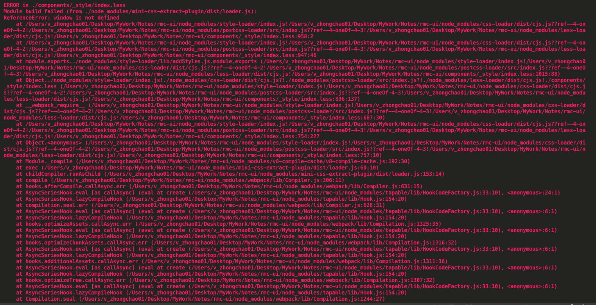
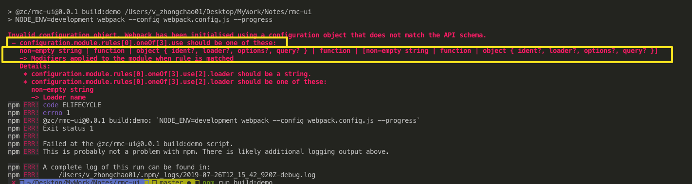
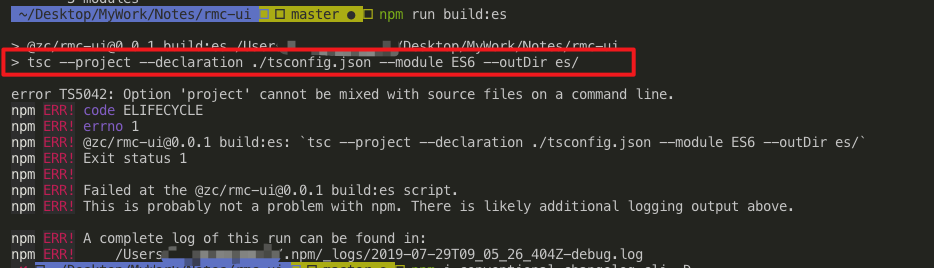
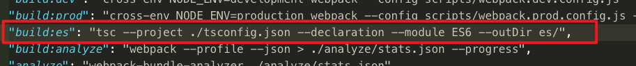
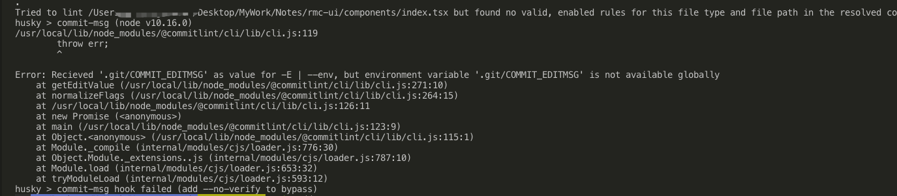
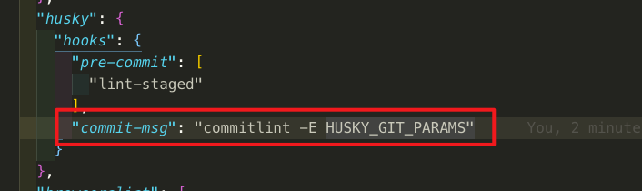

# rmc-ui
@react mobile components ui design for study

### origin

- study for design mobile components using react

### plan

- **Branch**

```javascript
master -> framework
components -> components-xxx -> coding for components
release -> lib
```

- **How to design and coding component?**

```javascript
need to suggest
```

- **Other aspects**

```javascript
need to consider
```

#### 搭建出现问题及其解决方法

- Q1
```bash
ERROR in ./components/Alert/style/index.less
Module build failed (from ./node_modules/mini-css-extract-plugin/dist/loader.js):
ReferenceError: window is not defined
    at /Users/v_zhongchao01/Desktop/MyWork/Notes/rmc-ui/node_modules/style-loader/index.js!/Users/v_zhongchao01/Desktop/MyWork/Notes/rmc-ui/node_modules/css-loader/dist/cjs.js??ref--4-oneOf-3-2!/Users/v_zhongchao01/Desktop/MyWork/Notes/rmc-ui/node_modules/postcss-loader/src/index.js??ref--4-oneOf-3-3!/Users/v_zhongchao01/Desktop/MyWork/Notes/rmc-ui/node_modules/less-loader/dist/cjs.js!/Users/v_zhongchao01/Desktop/MyWork/Notes/rmc-ui/components/Alert/style/index.less:958:2
```


> `MiniCSSExtractPlugin`将`CSS`提取到单独的文件中, 并将资源添加到`webpack`的资源`map`中。 另一方面, `style-loader`将`CSS`作为字符串嵌入到JS包本身中, 然后在运行时将其注入带有样式标记的`DOM`中, 通常用于在`html`文档中嵌入样式内联。这些方法冲突，因此错误。

解决办法: 注释`loader`中使用`mini-css-extract-plugin`的`style-loader`

[ReferenceError: window is not defined](https://github.com/webpack-contrib/mini-css-extract-plugin/issues/173#issuecomment-398144318)

- Q2
```bash
Invalid configuration object. Webpack has been initialised using a configuration object that does not match the API schema.
 - configuration.module.rules[0].oneOf[3].use should be one of these:
   non-empty string | function | object { ident?, loader?, options?, query? } | function | [non-empty string | function | object { ident?, loader?, options?, query? }]
```


解决办法: 配置的`loader`中类型不对

- Q3
```bash
error TS5042: Option 'project' cannot be mixed with source files on a command line.
```


解决办法: 

- Q4
```bash
/usr/local/lib/node_modules/@commitlint/cli/lib/cli.js:119
        throw err;
        ^

Error: Recieved '.git/COMMIT_EDITMSG' as value for -E | --env, but environment variable '.git/COMMIT_EDITMSG' is not available globally
    at getEditValue (/usr/local/lib/node_modules/@commitlint/cli/lib/cli.js:271:10)
    at normalizeFlags (/usr/local/lib/node_modules/@commitlint/cli/lib/cli.js:264:15)
    at /usr/local/lib/node_modules/@commitlint/cli/lib/cli.js:126:11
    at new Promise (<anonymous>)
    at main (/usr/local/lib/node_modules/@commitlint/cli/lib/cli.js:123:9)
    at Object.<anonymous> (/usr/local/lib/node_modules/@commitlint/cli/lib/cli.js:115:1)
    at Module._compile (internal/modules/cjs/loader.js:776:30)
    at Object.Module._extensions..js (internal/modules/cjs/loader.js:787:10)
    at Module.load (internal/modules/cjs/loader.js:653:32)
    at tryModuleLoad (internal/modules/cjs/loader.js:593:12)
husky > commit-msg hook failed (add --no-verify to bypass)
```




解决办法: 删除`commit-msg`中的`$`



- Q5
```bash
Invalid hook call. Hooks can only be called inside of the body of a function component. This could happen for one of the following reasons:
1. You might have mismatching versions of React and the renderer (such as React DOM)
2. You might be breaking the Rules of Hooks
3. You might have more than one copy of React in the same app
See https://fb.me/react-invalid-hook-call for tips about how to debug and fix this problem.
```

[解决办法](https://github.com/pedronauck/docz/issues/707):
1. Add .docz to .gitignore
2. In frontend folder, rm -rf node_modules package-lock.json .docz
3. In frontend folder, npm i
4. In frontend folder, docz dev
